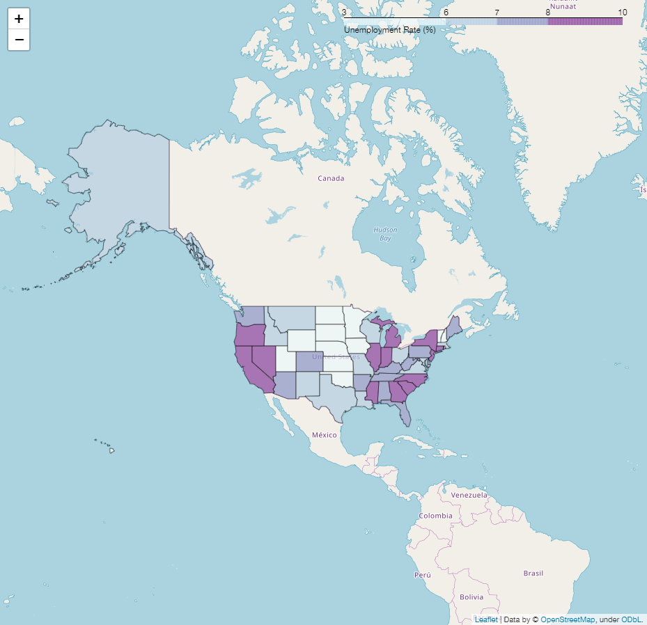
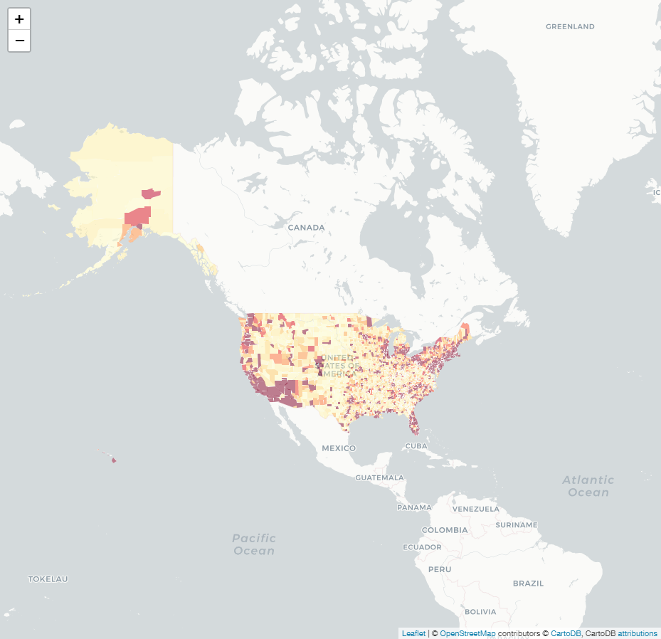
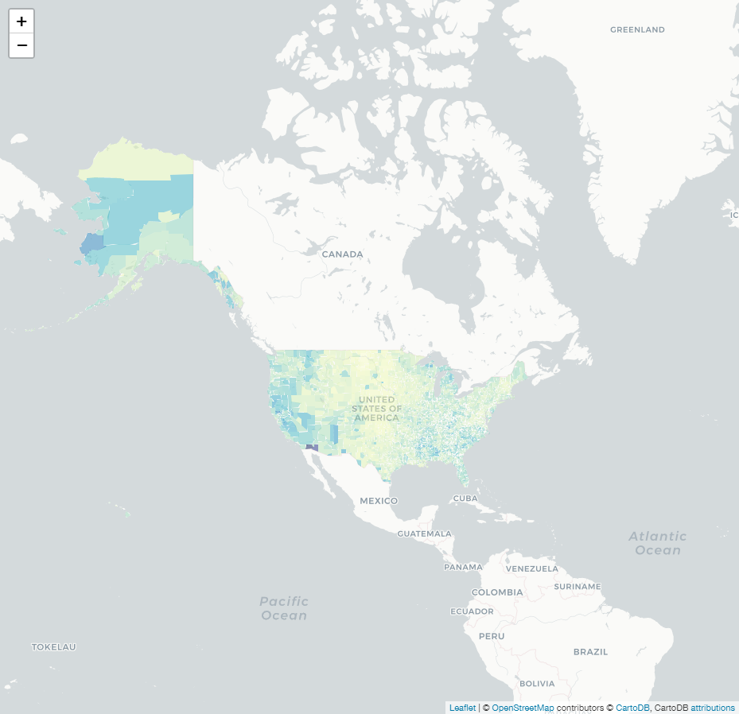
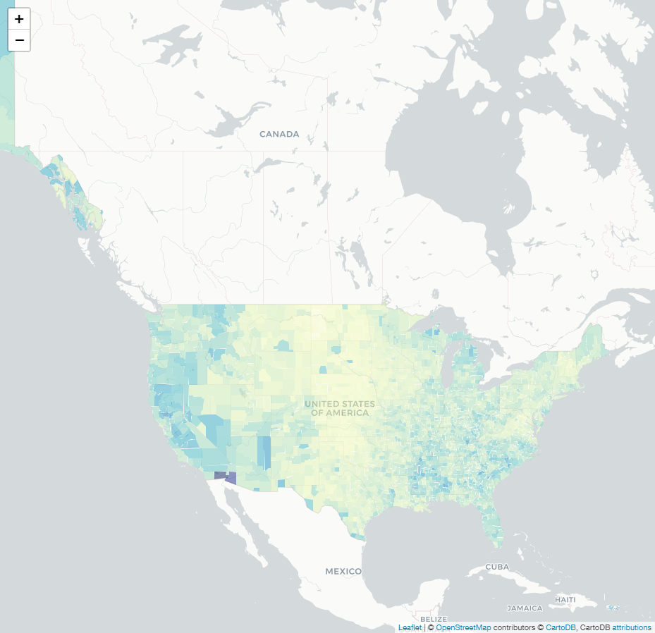
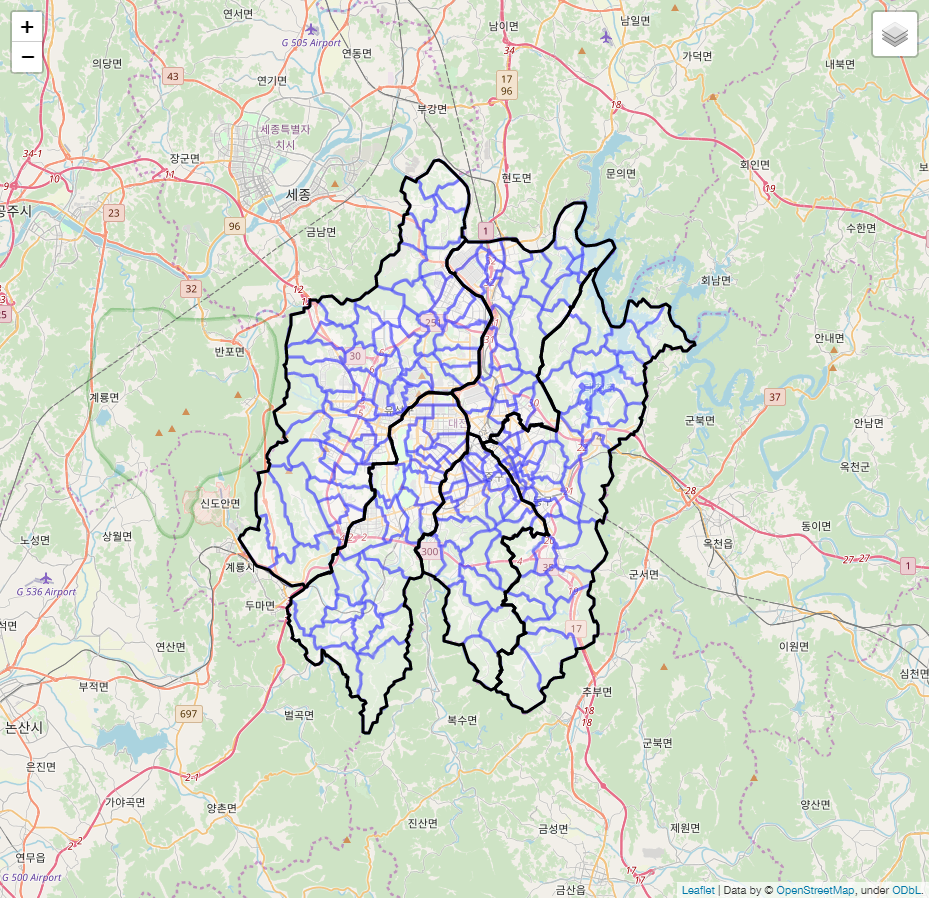

# Overlay Administrative District on Map using `folium` and `geojson`
* Official github of `folium`
> https://github.com/python-visualization/folium  
* Core of the following code is taken from:  
> https://ericnjennifer.github.io/python_visualization/2018/01/21/PythonVisualization_Chapt6.html  
> https://python-visualization.github.io/folium/quickstart.html  
> https://neurowhai.tistory.com/350  
> https://dailyheumsi.tistory.com/85  
> https://dailyheumsi.tistory.com/92

## 0. Export map (.html) to image (.png)
* In this example, `google chrome` browser was used,  which requires **<a href="http://chromedriver.chromium.org/downloads">`ChromeDriver`-WebDriver for Chrome</a>**.
* `ChromeDriver` requires `path` to be called by python script. 


```python
from selenium import webdriver
import time, os

def export_png(m,                     # foium map instance
               html_name,             # str. ex. 'testmap.html'
               png_name='map.png',    # str. ex. 'testmap.png'
               delay=5,               # int or float. ex. 10
              ):
  
  delay=delay
  fn = 'html/' + html_name
  tmpurl='file://{path}/{mapfile}'.format(path=os.getcwd(),mapfile=fn)
  m.save(fn)

  browser = webdriver.Chrome()
  browser.get(tmpurl)
  
  #Give the map tiles some time to load
  time.sleep(delay)
  browser.save_screenshot('./images/'+png_name)
  browser.quit()
```

## 1. Basic : Seoul Map
### 1.0. Object creation


```python
import folium

map_osm = folium.Map(location=[37.566345, 126.977893])   # Seoul City Hall
#map_osm.save('./map1.html')      # Save map as html
export_png(map_osm, 'map1.html', 'map1.png')   # Save map as png
#map_osm    # Show map on Notebook
```


### 1.1. Set Initial Zoom


```python
map_osm = folium.Map(location=[37.566345, 126.977893], zoom_start=17)  # Zoom Level Set
export_png(map_osm, 'map2.html', 'map2.png')
```


### 1.2. Another Map Type
* Stamen Terrain : Good for visualizaiton of landscape, such as mountains and rivers.


```python
map_osm = folium.Map(location=[37.566345, 126.977893], zoom_start=17,
                    tiles='Stamen Terrain'  # Tiles setting
                    )  
export_png(map_osm, 'map3.html', 'map3.png')
```


* Stamen Toner


```python
map_osm = folium.Map(location=[37.566345, 126.977893], zoom_start=17,
                    tiles='Stamen Toner'  # Tiles setting
                    )  
export_png(map_osm, 'map4.html', 'map4.png')
```


* CartoDBPositron


```python
map_osm = folium.Map(location=[37.566345, 126.977893], zoom_start=17, 
                     tiles='cartodbpositron'
                    )
export_png(map_osm, 'map5.html', 'map5.png')
```


### 1.3. Marker and Popup
* Marker : to experience interactive `Markers`, please click the link below


```python
map_osm = folium.Map(location=[37.566345, 126.977893], zoom_start=17)
folium.Marker([37.566345, 126.977893], popup='서울특별시청').add_to(map_osm)
folium.Marker([37.5658859, 126.9754788], popup='덕수궁').add_to(map_osm)
export_png(map_osm, 'map6.html', 'map6.png')
```

interactive html : <a href=https://rawcdn.githack.com/jehyunlee/code-snippet/4f9c05c257dba9ad34cc4b55238b25e5081810d2/1_folium_geojson/html/map6.html>link</a>


* CircleMarker


```python
map_osm = folium.Map(location=[37.566345, 126.977893], zoom_start=17)

folium.Marker([37.566345, 126.977893], 
              popup='서울특별시청', 
              icon=folium.Icon(color='red', icon='info-sign')
             ).add_to(map_osm)

folium.CircleMarker([37.5658859, 126.9754788], 
                    radius=100, 
                    color='#3186cc', 
                    fill_color='#3186cc', 
                    popup='덕수궁').add_to(map_osm)

export_png(map_osm, 'map7.html', 'map7.png')
```

interactive html : <a href=https://rawcdn.githack.com/jehyunlee/code-snippet/660a1bd588792345f448323fe342ce9aaa646aff/1_folium_geojson/html/map7.html>link</a>


### 1.4. Popover Latitutde and Longitude
* Popover : to experience interactive `Popover`, please click the link below


```python
m = folium.Map(
    location=[36.340744, 127.401358],    # Daejeon, Korea
    tiles='Stamen Terrain',
    zoom_start=11
)

m.add_child(folium.LatLngPopup())

export_png(m, 'map8.html', 'map8.png')
```

interactive html : <a href=https://rawcdn.githack.com/jehyunlee/code-snippet/b5df2624911437af4a65b5ab4e433995f5a2de54/1_folium_geojson/html/map8.html>link</a>


## 2.0. GEOJSON/TOPOJSON Overlays
### 2.1. Simple Boundary Overlay

#### 2.1.1. Loading json from file


```python
import json

m = folium.Map(location=[37.566345, 126.977893])

rfile = open('./Korea_gu_20.json', 'r', encoding='utf-8').read()        # Reading Admin. Districts
jsonData = json.loads(rfile)        # Reading as dictionary
style_function = {
                 'fillColor': 'white',
                }
folium.GeoJson(jsonData, name='json_data',
               style_function=lambda x: style_function        # style_function has to be a function which calls dictionary
              ).add_to(m)        # Overlay on map

export_png(m, 'map9.html', 'map9.png')
```

interactive html : <a href=https://rawcdn.githack.com/jehyunlee/code-snippet/a08dbbd096cab34aae85cedc81457d624e6d0190/1_folium_geojson/html/map9.html>link</a>


#### 2.1.2. Loading json from web


```python
m = folium.Map(location=[37.566345, 126.977893], zoom_start=8)

jsonData = f'https://raw.githubusercontent.com/jehyunlee/data-snippet/master/Korea_gu_20.json'        # Reading Admin. Districts

style_function = {
                 'fillColor': 'white',
                 'color':'black'              # edge color change : black
                }
folium.GeoJson(jsonData, name='json_data',
               style_function=lambda x: style_function        # style_function has to be a function which calls dictionary
              ).add_to(m)        # Overlay on map

export_png(m, 'map10.html', 'map10.png')
```

interactive html : <a href=https://rawcdn.githack.com/jehyunlee/code-snippet/632f5ab6ec24075e5a858dbf7e3a28ac251ee82a/1_folium_geojson/html/map10.html>link</a>


#### 2.1.3. Overlay of GeoJson and Topojson Together


```python
import requests

url = 'https://raw.githubusercontent.com/python-visualization/folium/master/examples/data'
antarctic_ice_edge = f'{url}/antarctic_ice_edge.json'
antarctic_ice_shelf_topo = f'{url}/antarctic_ice_shelf_topo.json'

m = folium.Map(
    location=[-59.1759, -11.6016],
    tiles='Mapbox Bright',
    zoom_start=2  # Limited levels of zoom for free Mapbox tiles.
)

folium.GeoJson(
    antarctic_ice_edge,
    name='geojson'
).add_to(m)

folium.TopoJson(
    json.loads(requests.get(antarctic_ice_shelf_topo).text),
    'objects.antarctic_ice_shelf',
    name='topojson'
).add_to(m)

folium.LayerControl().add_to(m)

export_png(m, 'map11.html', 'map11.png')
```

interactive html : <a href='https://rawcdn.githack.com/jehyunlee/code-snippet/e409914c9179d73f266f8001811b43eb2d3d835b/1_folium_geojson/html/map11.html'>link</a>


### 2.2. Choropleth maps


```python
import pandas as pd

url = 'https://raw.githubusercontent.com/python-visualization/folium/master/examples/data'
state_geo = f'{url}/us-states.json'
state_unemployment = f'{url}/US_Unemployment_Oct2012.csv'
state_data = pd.read_csv(state_unemployment)

m = folium.Map(location=[48, -102], zoom_start=3)

folium.Choropleth(
    geo_data=state_geo,
    name='choropleth',
    data=state_data,
    columns=['State', 'Unemployment'],
    key_on='feature.id',
    fill_color='YlGn',
    fill_opacity=0.7,
    line_opacity=0.2,
    legend_name='Unemployment Rate (%)'
).add_to(m)

folium.LayerControl().add_to(m)

export_png(m, 'map12.html', 'map12.png')
```

interactive html : <a href='https://rawcdn.githack.com/jehyunlee/code-snippet/1973967361e70c68282e8861dad8c0ad161ec39f/1_folium_geojson/html/map12.html'>link</a>


* bins by data Quantile


```python
bins = list(state_data['Unemployment'].quantile([0, 0.25, 0.5, 0.75, 1]))

m = folium.Map(location=[48, -102], zoom_start=3)

folium.Choropleth(
    geo_data=state_geo,
    data=state_data,
    columns=['State', 'Unemployment'],
    key_on='feature.id',
    fill_color='BuPu',
    fill_opacity=0.7,
    line_opacity=0.5,
    legend_name='Unemployment Rate (%)',
    bins=bins,
    reset=True
).add_to(m)

export_png(m, 'map13.html', 'map13.png')
```

interactive html : <a href='https://rawcdn.githack.com/jehyunlee/code-snippet/1973967361e70c68282e8861dad8c0ad161ec39f/1_folium_geojson/html/map13.html'>link</a>



* Color brewer function of `folium.utilities`
> https://github.com/python-visualization/folium/blob/v0.2.0/folium/utilities.py#L104

```python
def color_brewer(color_code, n=6):
    """
    Generate a colorbrewer color scheme of length 'len', type 'scheme.
    Live examples can be seen at http://colorbrewer2.org/
    """
    maximum_n = 253

    scheme_info = {'BuGn': 'Sequential',
                   'BuPu': 'Sequential',
                   'GnBu': 'Sequential',
                   'OrRd': 'Sequential',
                   'PuBu': 'Sequential',
                   'PuBuGn': 'Sequential',
                   'PuRd': 'Sequential',
                   'RdPu': 'Sequential',
                   'YlGn': 'Sequential',
                   'YlGnBu': 'Sequential',
                   'YlOrBr': 'Sequential',
                   'YlOrRd': 'Sequential',
                   'BrBg': 'Diverging',
                   'PiYG': 'Diverging',
                   'PRGn': 'Diverging',
                   'PuOr': 'Diverging',
                   'RdBu': 'Diverging',
                   'RdGy': 'Diverging',
                   'RdYlBu': 'Diverging',
                   'RdYlGn': 'Diverging',
                   'Spectral': 'Diverging',
                   'Accent': 'Qualitative',
                   'Dark2': 'Qualitative',
                   'Paired': 'Qualitative',
                   'Pastel1': 'Qualitative',
                   'Pastel2': 'Qualitative',
                   'Set1': 'Qualitative',
                   'Set2': 'Qualitative',
                   'Set3': 'Qualitative',
                   }

    schemes = {'BuGn': ['#EDF8FB', '#CCECE6', '#CCECE6',
                        '#66C2A4', '#41AE76', '#238B45', '#005824'],
               'BuPu': ['#EDF8FB', '#BFD3E6', '#9EBCDA',
                        '#8C96C6', '#8C6BB1', '#88419D', '#6E016B'],
               'GnBu': ['#F0F9E8', '#CCEBC5', '#A8DDB5',
                        '#7BCCC4', '#4EB3D3', '#2B8CBE', '#08589E'],
               'OrRd': ['#FEF0D9', '#FDD49E', '#FDBB84',
                        '#FC8D59', '#EF6548', '#D7301F', '#990000'],
               'PuBu': ['#F1EEF6', '#D0D1E6', '#A6BDDB',
                        '#74A9CF', '#3690C0', '#0570B0', '#034E7B'],
               'PuBuGn': ['#F6EFF7', '#D0D1E6', '#A6BDDB',
                          '#67A9CF', '#3690C0', '#02818A', '#016450'],
               'PuRd': ['#F1EEF6', '#D4B9DA', '#C994C7',
                        '#DF65B0', '#E7298A', '#CE1256', '#91003F'],
               'RdPu': ['#FEEBE2', '#FCC5C0', '#FA9FB5',
                        '#F768A1', '#DD3497', '#AE017E', '#7A0177'],
               'YlGn': ['#FFFFCC', '#D9F0A3', '#ADDD8E',
                        '#78C679', '#41AB5D', '#238443', '#005A32'],
               'YlGnBu': ['#FFFFCC', '#C7E9B4', '#7FCDBB',
                          '#41B6C4', '#1D91C0', '#225EA8', '#0C2C84'],
               'YlOrBr': ['#FFFFD4', '#FEE391', '#FEC44F',
                          '#FE9929', '#EC7014', '#CC4C02', '#8C2D04'],
               'YlOrRd': ['#FFFFB2', '#FED976', '#FEB24C',
                          '#FD8D3C', '#FC4E2A', '#E31A1C', '#B10026'],
               'BrBg': ['#8c510a', '#d8b365', '#f6e8c3',
                        '#c7eae5', '#5ab4ac', '#01665e'],
               'PiYG': ['#c51b7d', '#e9a3c9', '#fde0ef',
                        '#e6f5d0', '#a1d76a', '#4d9221'],
               'PRGn': ['#762a83', '#af8dc3', '#e7d4e8',
                        '#d9f0d3', '#7fbf7b', '#1b7837'],
               'PuOr': ['#b35806', '#f1a340', '#fee0b6',
                        '#d8daeb', '#998ec3', '#542788'],
               'RdBu': ['#b2182b', '#ef8a62', '#fddbc7',
                        '#d1e5f0', '#67a9cf', '#2166ac'],
               'RdGy': ['#b2182b', '#ef8a62', '#fddbc7',
                        '#e0e0e0', '#999999', '#4d4d4d'],
               'RdYlBu': ['#d73027', '#fc8d59', '#fee090',
                          '#e0f3f8', '#91bfdb', '#4575b4'],
               'RdYlGn': ['#d73027', '#fc8d59', '#fee08b',
                          '#d9ef8b', '#91cf60', '#1a9850'],
               'Spectral': ['#d53e4f', '#fc8d59', '#fee08b',
                            '#e6f598', '#99d594', '#3288bd'],
               'Accent': ['#7fc97f', '#beaed4', '#fdc086',
                          '#ffff99', '#386cb0', '#f0027f'],
               'Dark2': ['#1b9e77', '#d95f02', '#7570b3',
                         '#e7298a', '#66a61e', '#e6ab02'],
               'Paired': ['#a6cee3', '#1f78b4', '#b2df8a',
                          '#33a02c', '#fb9a99', '#e31a1c'],
               'Pastel1': ['#fbb4ae', '#b3cde3', '#ccebc5',
                           '#decbe4', '#fed9a6', '#ffffcc'],
               'Pastel2': ['#b3e2cd', '#fdcdac', '#cbd5e8',
                           '#f4cae4', '#e6f5c9', '#fff2ae'],
               'Set1': ['#e41a1c', '#377eb8', '#4daf4a',
                        '#984ea3', '#ff7f00', '#ffff33'],
               'Set2': ['#66c2a5', '#fc8d62', '#8da0cb',
                        '#e78ac3', '#a6d854', '#ffd92f'],
               'Set3': ['#8dd3c7', '#ffffb3', '#bebada',
                        '#fb8072', '#80b1d3', '#fdb462'],
               }

    # Raise an error if the n requested is greater than the maximum.
    if n > maximum_n:
        raise ValueError("The maximum number of colors in a"
                         " ColorBrewer sequential color series is 253")

    # Only if n is greater than six do we interpolate values.
    if n > 6:
        if color_code not in schemes:
            color_scheme = None
        else:
            # Check to make sure that it is not a qualitative scheme.
            if scheme_info[color_code] == 'Qualitative':
                raise ValueError("Expanded color support is not available"
                                 " for Qualitative schemes, restrict"
                                 " number of colors to 6")
            else:
                color_scheme = linear_gradient(schemes.get(color_code), n)
    else:
        color_scheme = schemes.get(color_code, None)
    return color_scheme
```

### 2.3. Styling Function
* `style_function` supports aesthetics tuning. 
* It should be noted that `style_function` has to be a `function` which returns `dictionary` type parameters.


```python
import branca

url = 'https://raw.githubusercontent.com/python-visualization/folium/master/examples/data'
county_data = f'{url}/us_county_data.csv'
county_geo = f'{url}/us_counties_20m_topo.json'

df = pd.read_csv(county_data, na_values=[' '])

colorscale = branca.colormap.linear.YlOrRd_09.scale(0, 50e3)
employed_series = df.set_index('FIPS_Code')['Employed_2011']

def style_function(feature):
    employed = employed_series.get(int(feature['id'][-5:]), None)
    return {
        'fillOpacity': 0.5,
        'weight': 0,
        'fillColor': '#black' if employed is None else colorscale(employed)
    }

m = folium.Map(
    location=[48, -102],
    tiles='cartodbpositron',
    zoom_start=3
)

folium.TopoJson(
    json.loads(requests.get(county_geo).text),
    'objects.us_counties_20m',
    style_function=style_function
).add_to(m)

export_png(m, 'map14.html', 'map14.png')
```

interactive html : <a href='https://rawcdn.githack.com/jehyunlee/code-snippet/1973967361e70c68282e8861dad8c0ad161ec39f/1_folium_geojson/html/map14.html'>link</a>



* Another Colormap 

> `branca` is a spinoff from `folium`, that would host the non-map-specific features.  (<a href='https://github.com/python-visualization/branca'>Link</a>)  
> There's no documentation, but you can browse the <a href='http://nbviewer.jupyter.org/github/python-visualization/branca/tree/master/examples'>examples gallery</a>.  
> `branca` is useful to generate a asymmetric colorbar, as such <a href='https://stackoverflow.com/questions/47846744/create-an-asymmetric-colormap'>examples</a>.  
> Official github: https://github.com/python-visualization/branca


```python
colorscale = branca.colormap.linear.PuRd_09.scale(0, 100000)

employed_series = df.set_index('FIPS_Code')['Median_Household_Income_2011'].dropna()


def style_function(feature):
    employed = employed_series.get(int(feature['id'][-5:]), None)
    return {
        'fillOpacity': 0.5,
        'weight': 0,
        'fillColor': '#black' if employed is None else colorscale(employed)
    }


m = folium.Map(
    location=[48, -102],
    tiles='cartodbpositron',
    zoom_start=3
)

folium.TopoJson(
    json.loads(requests.get(county_geo).text),
    'objects.us_counties_20m',
    style_function=style_function
).add_to(m)

export_png(m, 'map15.html', 'map15.png')
```

interactive html : <a href='https://rawcdn.githack.com/jehyunlee/code-snippet/1973967361e70c68282e8861dad8c0ad161ec39f/1_folium_geojson/html/map15.html'>link</a>




```python
colorscale = branca.colormap.linear.YlGnBu_09.scale(0, 30)

employed_series = df.set_index('FIPS_Code')['Unemployment_rate_2011']


def style_function(feature):
    employed = employed_series.get(int(feature['id'][-5:]), None)
    return {
        'fillOpacity': 0.5,
        'weight': 0,
        'fillColor': '#black' if employed is None else colorscale(employed)
    }


m = folium.Map(
    location=[48, -102],
    tiles='cartodbpositron',
    zoom_start=4
)

folium.TopoJson(
    json.loads(requests.get(county_geo).text),
    'objects.us_counties_20m',
    style_function=style_function
).add_to(m)

export_png(m, 'map16.html', 'map16.png')
```

interactive html : <a href='https://rawcdn.githack.com/jehyunlee/code-snippet/1973967361e70c68282e8861dad8c0ad161ec39f/1_folium_geojson/html/map16.html'>link</a>



## 3. Application on Daejeon Solar Irradiation data Analysis
 


```python
import pandas as pd
```


```python
df = pd.read_excel('./dj_compact.xlsx')
df.head()
```


<div>
<style scoped>
    .dataframe tbody tr th:only-of-type {
        vertical-align: middle;
    }

    .dataframe tbody tr th {
        vertical-align: top;
    }

    .dataframe thead th {
        text-align: right;
    }
</style>
<table border="1" class="dataframe">
  <thead>
    <tr style="text-align: right;">
      <th></th>
      <th>gro_flo_co</th>
      <th>sig_cd</th>
      <th>sig_nm</th>
      <th>emd_cd</th>
      <th>emd_nm</th>
      <th>lon</th>
      <th>lat</th>
      <th>buld_area</th>
      <th>buld_elev</th>
      <th>y17</th>
      <th>st_y17</th>
    </tr>
  </thead>
  <tbody>
    <tr>
      <th>0</th>
      <td>1</td>
      <td>30110</td>
      <td>동구</td>
      <td>30110137</td>
      <td>대별동</td>
      <td>127.459746</td>
      <td>36.285880</td>
      <td>199.109760</td>
      <td>80.0</td>
      <td>1183.461879</td>
      <td>1444.473755</td>
    </tr>
    <tr>
      <th>1</th>
      <td>1</td>
      <td>30110</td>
      <td>동구</td>
      <td>30110105</td>
      <td>가오동</td>
      <td>127.454453</td>
      <td>36.308615</td>
      <td>77.392318</td>
      <td>71.0</td>
      <td>1152.176436</td>
      <td>1449.363159</td>
    </tr>
    <tr>
      <th>2</th>
      <td>1</td>
      <td>30110</td>
      <td>동구</td>
      <td>30110137</td>
      <td>대별동</td>
      <td>127.461521</td>
      <td>36.287914</td>
      <td>91.076386</td>
      <td>77.0</td>
      <td>1182.211623</td>
      <td>1444.473755</td>
    </tr>
    <tr>
      <th>3</th>
      <td>1</td>
      <td>30110</td>
      <td>동구</td>
      <td>30110137</td>
      <td>대별동</td>
      <td>127.462293</td>
      <td>36.287703</td>
      <td>51.201706</td>
      <td>78.0</td>
      <td>947.490926</td>
      <td>1444.473755</td>
    </tr>
    <tr>
      <th>4</th>
      <td>1</td>
      <td>30110</td>
      <td>동구</td>
      <td>30110137</td>
      <td>대별동</td>
      <td>127.461942</td>
      <td>36.283535</td>
      <td>455.844167</td>
      <td>80.0</td>
      <td>1277.921216</td>
      <td>1444.473755</td>
    </tr>
  </tbody>
</table>
</div>


> `gro_flo_co` : number of floors on ground  
> `sig_cd` : district ('gu') code  
> `sig_nm` : district ('gu') name  
> `emd_cd` : town ('dong') code  
> `emd_nm` : town ('dong') name  
> `lon` : longitude  
> `lat` : latitude  
> `buld_area` : building area  
> `buld_elev` : elevation of ground where the building stands on.  
> `y17` : average irradiation of year, including shading effect by nearby buildings  
> `st_y17` : average irradiation of year, measured by satellites. 


```python
df_gu = df.groupby(by='sig_nm').mean().reset_index()
print(df_gu.head())
print('\n# of gu in daejeon (by solar irradiation data) = {}'.format(df_gu.shape[0]))
```

      sig_nm  gro_flo_co   sig_cd        emd_cd         lon        lat  \
    0    대덕구    2.080898  30230.0  3.023011e+07  127.425629  36.391907   
    1     동구    2.028778  30110.0  3.011012e+07  127.446243  36.330741   
    2     서구    2.493731  30170.0  3.017011e+07  127.369153  36.319647   
    3    유성구    2.480617  30200.0  3.020012e+07  127.339416  36.368410   
    4     중구    2.077924  30140.0  3.014011e+07  127.414222  36.315139   
    
        buld_area  buld_elev          y17       st_y17  
    0  227.707653  57.003504  1064.705391  1439.913388  
    1  127.552283  73.383516  1041.501530  1442.023758  
    2  190.922317  62.107055  1130.255177  1446.711277  
    3  291.690482  65.701732  1111.219158  1446.773815  
    4  137.352281  62.724121  1062.345897  1449.680231  
    
    # of gu in daejeon (by solar irradiation data) = 5
    


```python
df_dong = df.groupby(by='emd_nm').mean().reset_index()
print(df_dong.head())
print('\n# of dong in daejeon (by solar irradiation data) = {}'.format(df_dong.shape[0]))
```

      emd_nm  gro_flo_co   sig_cd      emd_cd         lon        lat    buld_area  \
    0   가수원동    1.692657  30170.0  30170114.0  127.353482  36.301750   180.820143   
    1    가양동    2.099722  30110.0  30110114.0  127.445783  36.345642   128.429015   
    2    가오동    3.253482  30110.0  30110105.0  127.454580  36.307718   229.981281   
    3    가장동    1.877223  30170.0  30170109.0  127.387469  36.331240   145.159259   
    4    가정동    1.725275  30200.0  30200126.0  127.366689  36.380730  1094.530987   
    
       buld_elev          y17       st_y17  
    0  63.942468  1183.533958  1455.748407  
    1  71.217806  1021.838095  1441.657350  
    2  72.839109  1141.080659  1451.082202  
    3  46.594310  1102.165677  1442.068788  
    4  55.751209  1250.224541  1443.765304  
    
    # of dong in daejeon (by solar irradiation data) = 168
    


```python
# center of the map

lon_avg = df['lon'].mean()
lat_avg = df['lat'].mean()
print(lon_avg, lat_avg)
```

    127.4013580315068 36.340743659590096
    

* Read and Analyze geojson file

The structure of geojson file is :
<pre><code class="python"><font color='gray'>
{"type":"FeatureCollection",  
 "bbox":[<i>longitude_min</i>, <i>latitude_min</i>, <i>longitude_max</i>, <i>latitude_max</i>]    
 "features":[ 
              { "type":"feature",
                "geometry":{"type":"Polygon", "coordinates":[[ <i><font color='green'> ...many pairs of numbers... </font></i>]]],
                "properties":{"SIG_CD":"11110", "SIG_EMG_NM":"Jongno-gu", "SIG_KOR_NM":"종로구"},
                <i><font color='green'> ...repeating... </font></i>
}
</font></code></pre>


```python
# 'gu' and dong' data in Korea
gu = f'https://raw.githubusercontent.com/jehyunlee/data-snippet/master/Korea_gu_20.json' 
dong = f'https://raw.githubusercontent.com/jehyunlee/data-snippet/master/Korea_dong_20.json' 
```


```python
import urllib.request

def read_webjson(url):
  with urllib.request.urlopen(url) as src:
    data = json.loads(src.read().decode(), encoding='utf-8')
    return data 
```


```python
gu_data = read_webjson(gu)    # read 'gu' json from data-snippet
```


```python
# 'gu' filter : only Daejeon
gu_dj = {}
gu_dj_value = []
SIG_KOR_NM = []    # list of 'gu's

for key, value in gu_data.items():
  if key != 'features':
    gu_dj.update({key: value})
  else:
    for feature in gu_data['features']:
      properties = feature['properties']
      sig_cd = properties['SIG_CD']
      if sig_cd[:2] == '30':
        SIG_KOR_NM.append(properties['SIG_KOR_NM'])
        gu_dj_value.append(feature)
gu_dj['features'] = gu_dj_value
        
print('# of "gu"s in Daejeon = {}'.format(len(SIG_KOR_NM)))
print(SIG_KOR_NM)        

# save list of 'gu's in json format
with open("gu_dj.json","w", encoding='utf-8') as jsonfile:
        json.dump(gu_dj,jsonfile,ensure_ascii=False)
```

    # of "gu"s in Daejeon = 5
    ['동구', '중구', '서구', '유성구', '대덕구']
    


```python
# read 'dong'
# For unknown reason, it is not possible to read from web.
dong_data = json.loads(open('./Korea_dong_20.json', 'r', encoding='utf-8').read())
```


```python
# 'dong' filter : only Daejeon
dong_dj = {}
dong_dj_value = []
EMD_KOR_NM = []    # list of 'dong's

for key, value in dong_data.items():
  if key != 'features':
    dong_dj.update({key: value})
  else:
    for feature in dong_data['features']:
      properties = feature['properties']
      emd_cd = properties['EMD_CD']
      if emd_cd[:2] == '30':
        EMD_KOR_NM.append(properties['EMD_KOR_NM'])
        dong_dj_value.append(feature)
dong_dj['features'] = dong_dj_value

print('# of "dong"s in Daejeon = {}'.format(len(EMD_KOR_NM)))  # Wrong Value : Duplicates exist 
print(sorted(EMD_KOR_NM))  

# Find duplicates
import collections
print('\nDuplicates are {}'.format([item for item, count in collections.Counter(EMD_KOR_NM).items() if count > 1]))
EMD_KOR_NM = list(np.sort(np.unique(np.array(EMD_KOR_NM))))

print('\n# of  "dong"s in Daejeon = {}'.format(len(EMD_KOR_NM)))
print('List of  "dong"s in Daejeon = {}'.format(EMD_KOR_NM))

# Find missings in solar data
missing = []
for dong in EMD_KOR_NM:
  if dong not in dong_solar:
    missing.append(dong)
    
print('\nMissing "dong"s = {}'.format(missing))

# Save list of 'dong's in json format, including duplicates,
# because it is not important to treat them at the moment.
with open("dong_dj.json","w", encoding='utf-8') as jsonfile:
        json.dump(dong_dj,jsonfile,ensure_ascii=False)
```

    # of "dong"s in Daejeon = 177
    ['가수원동', '가양동', '가오동', '가장동', '가정동', '갈마동', '갈전동', '갑동', '계산동', '관저동', '관평동', '괴곡동', '괴정동', '교촌동', '구도동', '구룡동', '구성동', '구암동', '구완동', '궁동', '금고동', '금동', '금탄동', '낭월동', '내동', '내탑동', '노은동', '대동', '대동', '대별동', '대사동', '대성동', '대정동', '대화동', '대흥동', '덕명동', '덕암동', '덕진동', '도룡동', '도마동', '도안동', '둔곡동', '둔산동', '마산동', '만년동', '매노동', '목달동', '목동', '목상동', '무수동', '문지동', '문창동', '문평동', '문화동', '미호동', '반석동', '방동', '방현동', '법동', '변동', '복수동', '복용동', '봉곡동', '봉명동', '봉산동', '부사동', '부수동', '비래동', '비룡동', '사성동', '사정동', '산성동', '산직동', '삼괴동', '삼성동', '삼정동', '삼정동', '상대동', '상서동', '상소동', '석교동', '석봉동', '선화동', '성남동', '성북동', '세동', '세천동', '소제동', '소호동', '송강동', '송정동', '송촌동', '수남동', '신대동', '신동', '신봉동', '신상동', '신성동', '신안동', '신일동', '신촌동', '신탄진동', '신하동', '신흥동', '안산동', '안영동', '어남동', '어은동', '연축동', '오동', '오동', '오류동', '오정동', '옥계동', '와동', '외삼동', '용계동', '용계동', '용두동', '용문동', '용산동', '용운동', '용전동', '용촌동', '용호동', '우명동', '원내동', '원동', '원신흥동', '원정동', '원촌동', '월평동', '유천동', '은행동', '읍내동', '이사동', '이현동', '인동', '자양동', '자운동', '장대동', '장동', '장동', '장안동', '장척동', '전민동', '정동', '정림동', '정생동', '주산동', '주촌동', '죽동', '중동', '중리동', '중촌동', '지족동', '직동', '천동', '추동', '추목동', '침산동', '탄방동', '탑립동', '태평동', '판암동', '평촌동', '평촌동', '하기동', '하소동', '학하동', '호동', '홍도동', '화암동', '황호동', '효동', '효평동', '흑석동']
    
    Duplicates are ['삼정동', '대동', '용계동', '오동', '평촌동', '장동']
    
    # of  "dong"s in Daejeon = 171
    List of  "dong"s in Daejeon = ['가수원동', '가양동', '가오동', '가장동', '가정동', '갈마동', '갈전동', '갑동', '계산동', '관저동', '관평동', '괴곡동', '괴정동', '교촌동', '구도동', '구룡동', '구성동', '구암동', '구완동', '궁동', '금고동', '금동', '금탄동', '낭월동', '내동', '내탑동', '노은동', '대동', '대별동', '대사동', '대성동', '대정동', '대화동', '대흥동', '덕명동', '덕암동', '덕진동', '도룡동', '도마동', '도안동', '둔곡동', '둔산동', '마산동', '만년동', '매노동', '목달동', '목동', '목상동', '무수동', '문지동', '문창동', '문평동', '문화동', '미호동', '반석동', '방동', '방현동', '법동', '변동', '복수동', '복용동', '봉곡동', '봉명동', '봉산동', '부사동', '부수동', '비래동', '비룡동', '사성동', '사정동', '산성동', '산직동', '삼괴동', '삼성동', '삼정동', '상대동', '상서동', '상소동', '석교동', '석봉동', '선화동', '성남동', '성북동', '세동', '세천동', '소제동', '소호동', '송강동', '송정동', '송촌동', '수남동', '신대동', '신동', '신봉동', '신상동', '신성동', '신안동', '신일동', '신촌동', '신탄진동', '신하동', '신흥동', '안산동', '안영동', '어남동', '어은동', '연축동', '오동', '오류동', '오정동', '옥계동', '와동', '외삼동', '용계동', '용두동', '용문동', '용산동', '용운동', '용전동', '용촌동', '용호동', '우명동', '원내동', '원동', '원신흥동', '원정동', '원촌동', '월평동', '유천동', '은행동', '읍내동', '이사동', '이현동', '인동', '자양동', '자운동', '장대동', '장동', '장안동', '장척동', '전민동', '정동', '정림동', '정생동', '주산동', '주촌동', '죽동', '중동', '중리동', '중촌동', '지족동', '직동', '천동', '추동', '추목동', '침산동', '탄방동', '탑립동', '태평동', '판암동', '평촌동', '하기동', '하소동', '학하동', '호동', '홍도동', '화암동', '황호동', '효동', '효평동', '흑석동']
    
    Missing "dong"s = ['부수동', '수남동', '황호동']
    

* Drawing map with administrative disticts boundary


```python
m = folium.Map(location=[lat_avg, lon_avg], zoom_start=11)

style_function_gu = {
                 'fillColor': 'white',
                 'color':'#000000FF'
                }

style_function_dong = {
                 'fillColor': 'white',
                 'color':'#0000FF66'
                }

folium.GeoJson(dong_dj, name='dong_dj',
               style_function=lambda x: style_function_dong        # style_function has to be a function which calls dictionary
              ).add_to(m)        # Overlay on map

folium.GeoJson(gu_dj, name='gu_dj',
               style_function=lambda x: style_function_gu        # style_function has to be a function which calls dictionary
              ).add_to(m)        # Overlay on map

folium.LayerControl().add_to(m)

export_png(m, 'map100.html', 'map100.png')
```

interactive html : <a href='https://rawcdn.githack.com/jehyunlee/code-snippet/1973967361e70c68282e8861dad8c0ad161ec39f/1_folium_geojson/html/map100.html'>link</a>



* Drawing map with a data : year-averaged solar irradiation


```python
# Draw map with administrative distructs

m = folium.Map(location=[lat_avg, lon_avg], zoom_start=11, tiles='Stamen Terrain')
bins = np.arange(df_dong['y17'].min(), df_dong['st_y17'].max()+100, 100)

folium.Choropleth(
    geo_data = dong_dj,
    data=df_dong,
    name='Satallite Irradiation',
    columns=['emd_nm', 'st_y17'],
    style_function=style_function_sty,
    key_on='feature.properties.EMD_KOR_NM',
    fill_color='YlOrRd',
    fill_opacity=1,
    line_opacity=1,
    legend_name='Satallite Irradiation'
).add_to(m)

folium.Choropleth(
    geo_data = dong_dj,
    data=df_dong,
    name='Irradiation with Shade',
    columns=['emd_nm', 'y17'],
    key_on='feature.properties.EMD_KOR_NM',
    fill_color='BuGn',
    fill_opacity=1,
    line_opacity=1,
    legend_name='Irradiation with Shade',
).add_to(m)

folium.LayerControl().add_to(m)

export_png(m, 'map101.html', 'map101.png')
```

interactive html : <a href='https://rawcdn.githack.com/jehyunlee/code-snippet/1973967361e70c68282e8861dad8c0ad161ec39f/1_folium_geojson/html/map101.html'>link</a>


