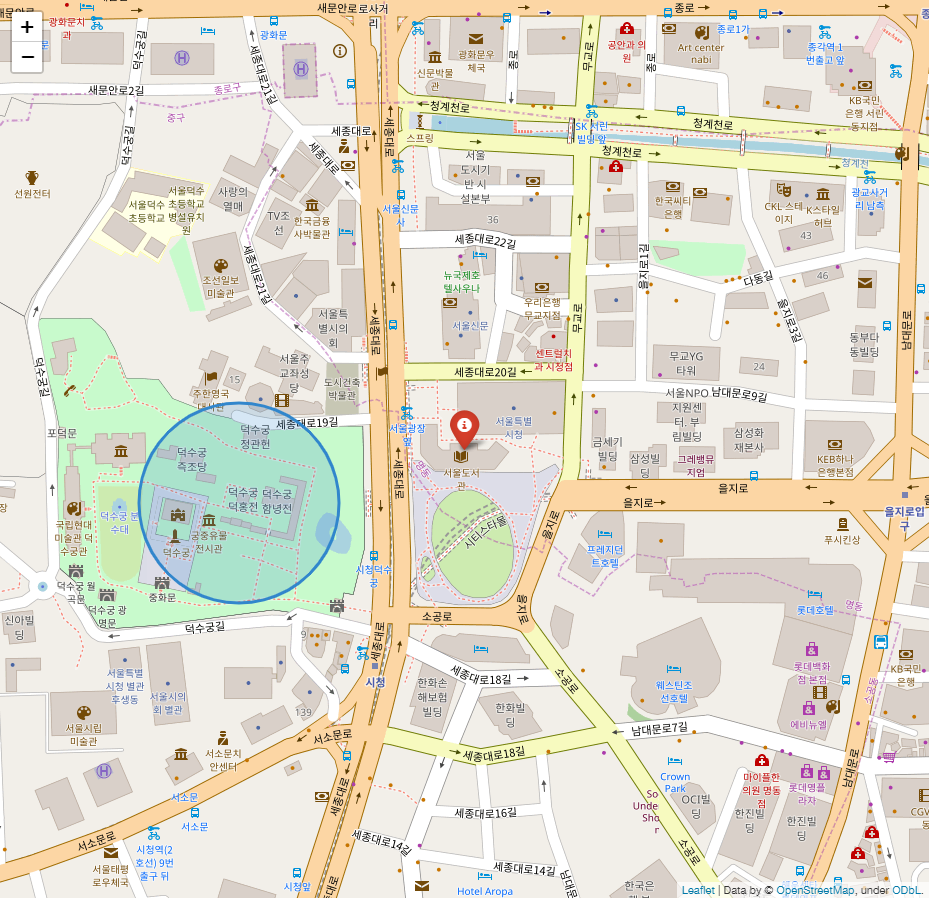
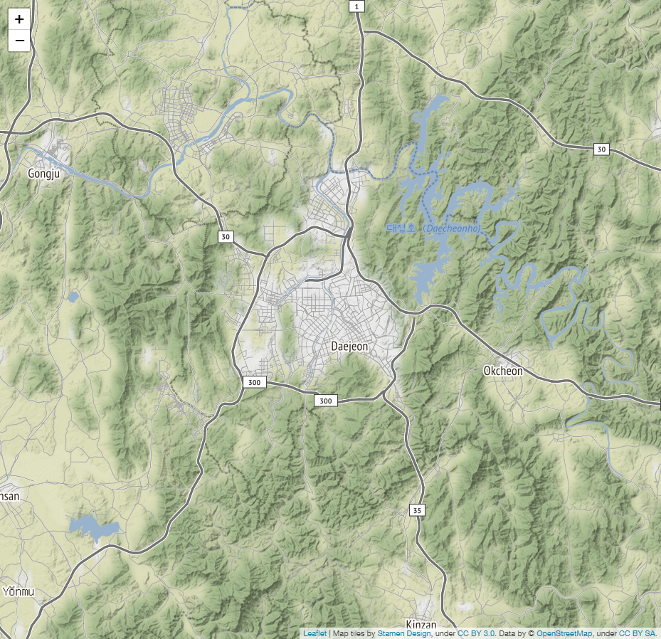
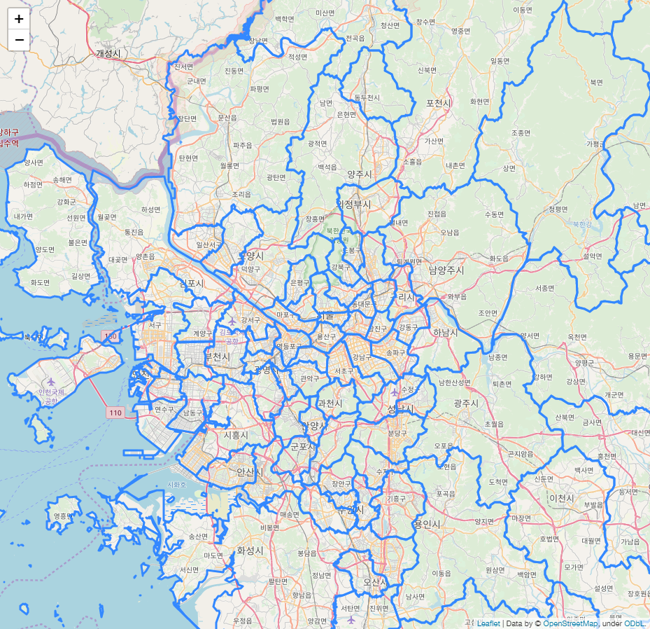
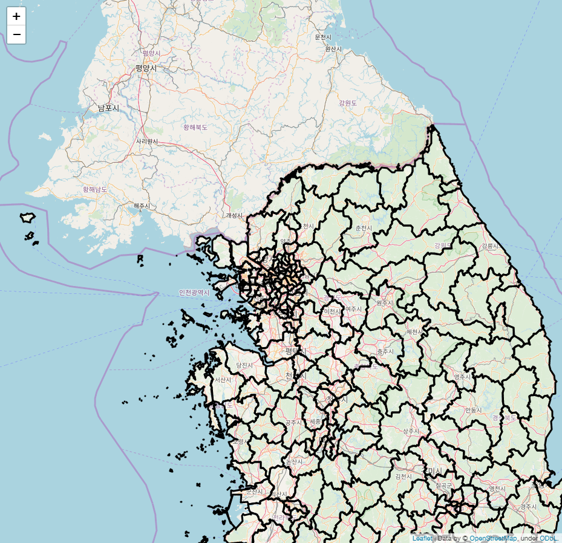
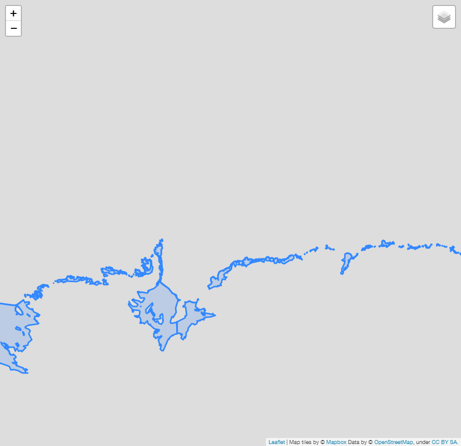

# Overlay Administrative District on Map using folium and geojson
* Official github of `folium`
> https://github.com/python-visualization/folium  
* Core of the following code is taken from:  
> https://ericnjennifer.github.io/python_visualization/2018/01/21/PythonVisualization_Chapt6.html  
> https://python-visualization.github.io/folium/quickstart.html  
> https://neurowhai.tistory.com/350  
> https://dailyheumsi.tistory.com/85  
> https://dailyheumsi.tistory.com/92

## 0. Export map (.html) to image (.png)
* In this example, `google chrome` browser was used,  which requires **<a href="http://chromedriver.chromium.org/downloads">`ChromeDriver`-WebDriver for Chrome</a>**.
* `ChromeDriver` requires `path` to be called by python script. 


```python
from selenium import webdriver
import time, os

def export_png(m,                     # foium map instance
               html_name,             # str. ex. 'testmap.html'
               png_name='map.png',    # str. ex. 'testmap.png'
               delay=5,               # int or float. ex. 10
              ):
  
  delay=delay
  fn = 'html/' + html_name
  tmpurl='file://{path}/{mapfile}'.format(path=os.getcwd(),mapfile=fn)
  m.save(fn)

  browser = webdriver.Chrome()
  browser.get(tmpurl)
  
  #Give the map tiles some time to load
  time.sleep(delay)
  browser.save_screenshot('./images/'+png_name)
  browser.quit()
```

## 1. Basic : Seoul Map
### 1.0. Object creation


```python
import folium

map_osm = folium.Map(location=[37.566345, 126.977893])   # Seoul City Hall
#map_osm.save('./map1.html')      # Save map as html
export_png(map_osm, 'map1.html', 'map1.png')   # Save map as png
#map_osm    # Show map on Notebook
```


### 1.1. Set Initial Zoom


```python
map_osm = folium.Map(location=[37.566345, 126.977893], zoom_start=17)  # Zoom Level Set
export_png(map_osm, 'map2.html', 'map2.png')
```


### 1.2. Another Map Type
* Stamen Terrain : Good for visualizaiton of landscape, such as mountains and rivers.


```python
map_osm = folium.Map(location=[37.566345, 126.977893], zoom_start=17,
                    tiles='Stamen Terrain'  # Tiles setting
                    )  
export_png(map_osm, 'map3.html', 'map3.png')
```


* Stamen Toner


```python
map_osm = folium.Map(location=[37.566345, 126.977893], zoom_start=17,
                    tiles='Stamen Toner'  # Tiles setting
                    )  
export_png(map_osm, 'map4.html', 'map4.png')
```


* CartoDBPositron


```python
map_osm = folium.Map(location=[37.566345, 126.977893], zoom_start=17, 
                     tiles='cartodbpositron'
                    )
export_png(map_osm, 'map5.html', 'map5.png')
```


### 1.3. Marker and Popup
* Marker : to experience interactive `Markers`, please click the link below


```python
map_osm = folium.Map(location=[37.566345, 126.977893], zoom_start=17)
folium.Marker([37.566345, 126.977893], popup='서울특별시청').add_to(map_osm)
folium.Marker([37.5658859, 126.9754788], popup='덕수궁').add_to(map_osm)
export_png(map_osm, 'map6.html', 'map6.png')
```

interactive html : <a href=https://rawcdn.githack.com/jehyunlee/code-snippet/4f9c05c257dba9ad34cc4b55238b25e5081810d2/1_folium_geojson/html/map6.html>link</a>


* CircleMarker


```python
map_osm = folium.Map(location=[37.566345, 126.977893], zoom_start=17)

folium.Marker([37.566345, 126.977893], 
              popup='서울특별시청', 
              icon=folium.Icon(color='red', icon='info-sign')
             ).add_to(map_osm)

folium.CircleMarker([37.5658859, 126.9754788], 
                    radius=100, 
                    color='#3186cc', 
                    fill_color='#3186cc', 
                    popup='덕수궁').add_to(map_osm)

export_png(map_osm, 'map7.html', 'map7.png')
```

interactive html : <a href=https://rawcdn.githack.com/jehyunlee/code-snippet/660a1bd588792345f448323fe342ce9aaa646aff/1_folium_geojson/html/map7.html>link</a>



### 1.4. Popover Latitutde and Longitude
* Popover : to experience interactive `Popover`, please click the link below


```python
m = folium.Map(
    location=[36.340744, 127.401358],    # Daejeon, Korea
    tiles='Stamen Terrain',
    zoom_start=11
)

m.add_child(folium.LatLngPopup())

export_png(m, 'map8.html', 'map8.png')
```

interactive html : <a href=https://rawcdn.githack.com/jehyunlee/code-snippet/b5df2624911437af4a65b5ab4e433995f5a2de54/1_folium_geojson/html/map8.html>link</a>



## 2.0. GEOJSON/TOPOJSON Overlays
### 2.1. Simple Boundary Overlay

#### 2.1.1. Loading json from file


```python
import json

m = folium.Map(location=[37.566345, 126.977893])

rfile = open('./Korea_gu_rough.json', 'r', encoding='utf-8').read()        # Reading Admin. Districts
jsonData = json.loads(rfile)        # Reading as dictionary
style_function = {
                 'fillColor': 'white',
                 'lineColor':'black'        # not working. why???
                }
folium.GeoJson(jsonData, name='json_data',
               style_function=lambda x: style_function        # style_function has to be a function which calls dictionary
              ).add_to(m)        # Overlay on map

export_png(m, 'map9.html', 'map9.png')
```

interactive html : <a href=https://rawcdn.githack.com/jehyunlee/code-snippet/a08dbbd096cab34aae85cedc81457d624e6d0190/1_folium_geojson/html/map9.html>link</a>



#### 2.1.2. Loading json from web


```python
import json

m = folium.Map(location=[37.566345, 126.977893], zoom_start=8)

jsonData = f'https://raw.githubusercontent.com/jehyunlee/data-snippet/master/Korea_gu_rough.json'        # Reading Admin. Districts

style_function = {
                 'fillColor': 'white',
                 'lineColor':'black'        # not working. why???
                }
folium.GeoJson(jsonData, name='json_data',
               style_function=lambda x: style_function        # style_function has to be a function which calls dictionary
              ).add_to(m)        # Overlay on map

export_png(m, 'map10.html', 'map10.png')
```

interactive html : <a href=https://rawcdn.githack.com/jehyunlee/code-snippet/632f5ab6ec24075e5a858dbf7e3a28ac251ee82a/1_folium_geojson/html/map10.html>link</a>



#### 2.1.3. Overlay of GeoJson and Topojson Together


```python
import requests

url = 'https://raw.githubusercontent.com/python-visualization/folium/master/examples/data'
antarctic_ice_edge = f'{url}/antarctic_ice_edge.json'
antarctic_ice_shelf_topo = f'{url}/antarctic_ice_shelf_topo.json'

m = folium.Map(
    location=[-59.1759, -11.6016],
    tiles='Mapbox Bright',
    zoom_start=2  # Limited levels of zoom for free Mapbox tiles.
)

folium.GeoJson(
    antarctic_ice_edge,
    name='geojson'
).add_to(m)

folium.TopoJson(
    json.loads(requests.get(antarctic_ice_shelf_topo).text),
    'objects.antarctic_ice_shelf',
    name='topojson'
).add_to(m)

folium.LayerControl().add_to(m)

export_png(m, 'map11.html', 'map11.png')
```

interactive html : <a href='https://rawcdn.githack.com/jehyunlee/code-snippet/e409914c9179d73f266f8001811b43eb2d3d835b/1_folium_geojson/html/map11.html'>link</a>


