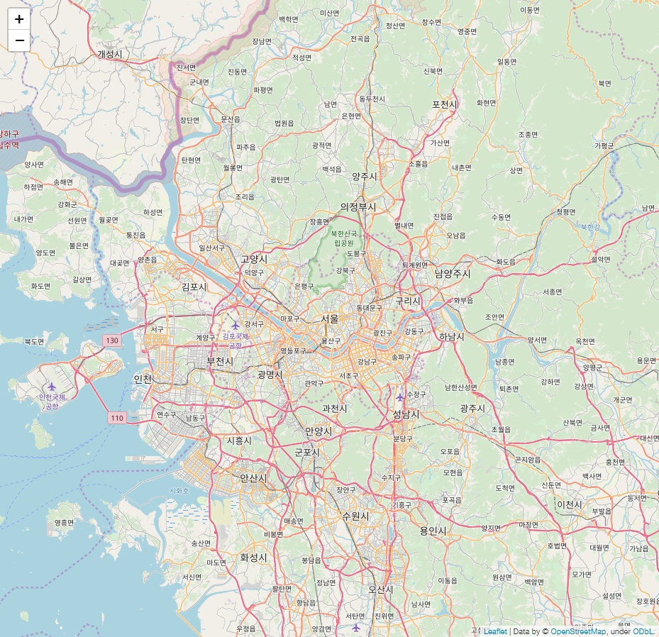
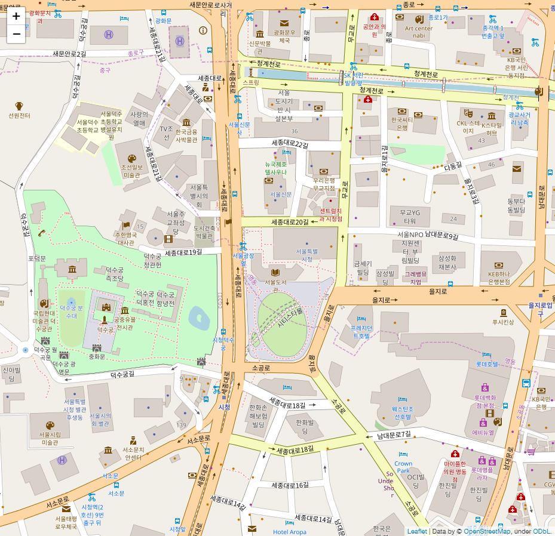
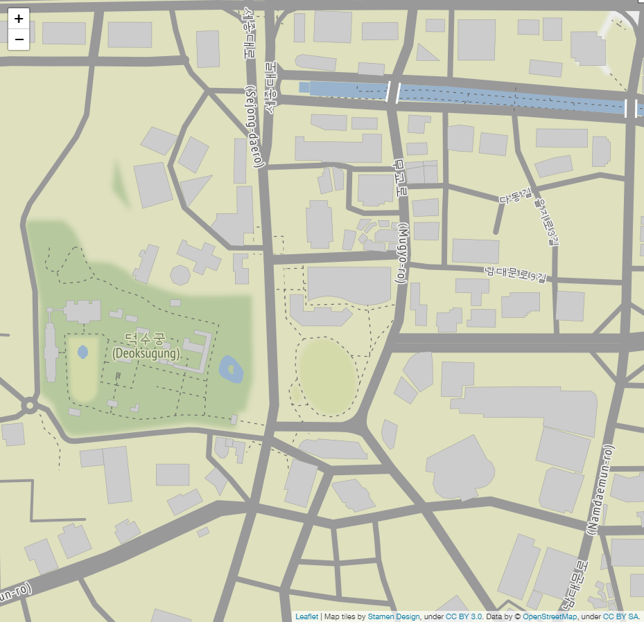
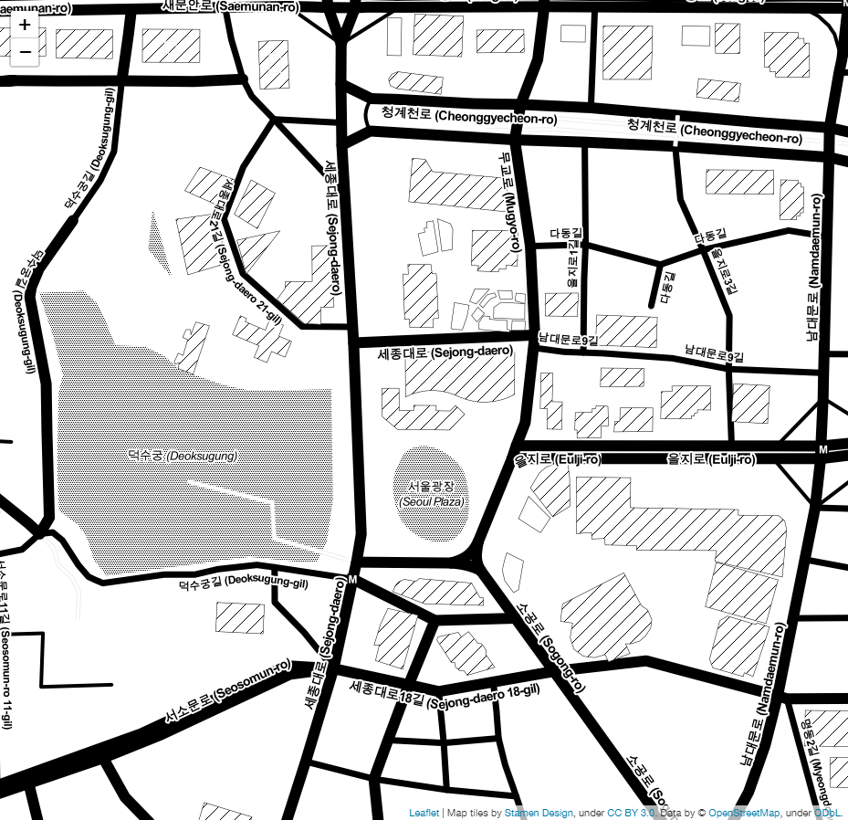
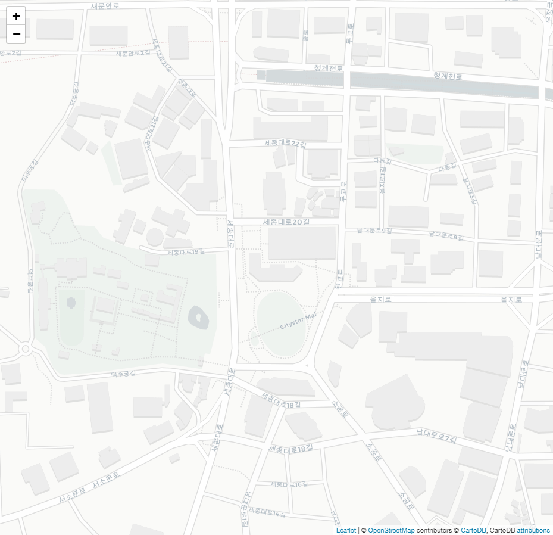
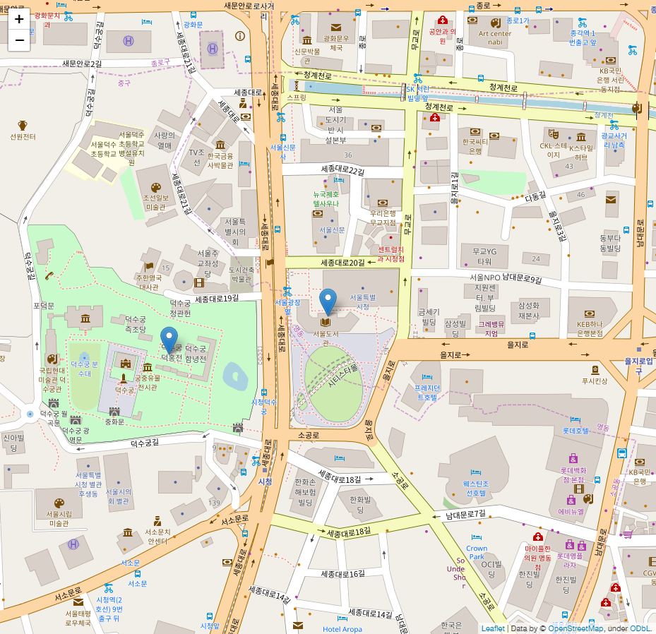

# Overlay Administrative District on Map using folium and geojson
* The following code is taken from:  
> https://ericnjennifer.github.io/python_visualization/2018/01/21/PythonVisualization_Chapt6.html  
> https://python-visualization.github.io/folium/quickstart.html

## 0. Export map (.html) to image (.png)
* In this example, `google chrome` browser was used,  which requires **<a href="http://chromedriver.chromium.org/downloads">`ChromeDriver`-WebDriver for Chrome</a>**.
* `ChromeDriver` requires `path` to be called by python script. 


```python
from selenium import webdriver
import time, os

def export_png(m,                          # foium map instance
               html_name,                       # str. ex. 'testmap.html'
               png_name='map.png',    # str. ex. 'testmap.png'
               delay=5,                             # int or float. ex. 10
              ):
  
  delay=delay
  fn = 'html/' + html_name
  tmpurl='file://{path}/{mapfile}'.format(path=os.getcwd(),mapfile=fn)
  m.save(fn)

  browser = webdriver.Chrome()
  browser.get(tmpurl)
  
  #Give the map tiles some time to load
  time.sleep(delay)
  browser.save_screenshot('./images/'+png_name)
  browser.quit()
```

## 1. Basic : Seoul Map
### 1.0. Object creation


```python
import folium

map_osm = folium.Map(location=[37.566345, 126.977893])   # Seoul City Hall
#map_osm.save('./map1.html')      # Save map as html
export_png(map_osm, 'map1.html', 'map1.png')   # Save map as png
#map_osm    # Show map on Notebook
```



### 1.1. Set Initial Zoom


```python
map_osm = folium.Map(location=[37.566345, 126.977893], zoom_start=17)  # Zoom Level Set
export_png(map_osm, 'map2.html', 'map2.png')
```



### 1.2. Another Map Type
* Stamen Terrain : Good for visualizaiton of landscape, such as mountains and rivers.


```python
map_osm = folium.Map(location=[37.566345, 126.977893], zoom_start=17,
                    tiles='Stamen Terrain'  # Tiles setting
                    )  
export_png(map_osm, 'map3.html', 'map3.png')
```



* Stamen Toner


```python
map_osm = folium.Map(location=[37.566345, 126.977893], zoom_start=17,
                    tiles='Stamen Toner'  # Tiles setting
                    )  
export_png(map_osm, 'map4.html', 'map4.png')
```



* CartoDBPositron


```python
map_osm = folium.Map(location=[37.566345, 126.977893], zoom_start=17, 
                     tiles='cartodbpositron'
                    )
export_png(map_osm, 'map5.html', 'map5.png')
```



### 1.3. Marker and Popup
* Marker


```python
map_osm = folium.Map(location=[37.566345, 126.977893], zoom_start=17)
folium.Marker([37.566345, 126.977893], popup='서울특별시청').add_to(map_osm)
folium.Marker([37.5658859, 126.9754788], popup='덕수궁').add_to(map_osm)
export_png(map_osm, 'map6.html', 'map6.png')
```

<a href='./html/map6.html'></a>


```python

```
