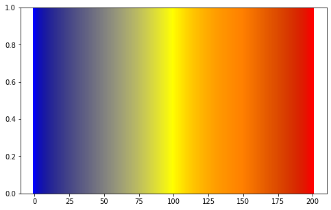

### **Additive Color Model Operation for 3 colors**

#### 1. import libraries, and set 3 colors


```python
import matplotlib as mpl
import matplotlib.pyplot as plt
import numpy as np

c1 = 'darkred'
c2 = 'teal'     # matplotlib defined color names
c3 = '#0000FF'    # 'blue'

c1 = np.array(mpl.colors.to_rgb(c1))
c2 = np.array(mpl.colors.to_rgb(c2))
c3 = np.array(mpl.colors.to_rgb(c3))

print(c1, c2, c3)
```

    [0.54509804 0.         0.        ] [0.         0.50196078 0.50196078] [0. 0. 1.]


#### 2. function definition


```python
def add_color(c1, c2, c3, ipol=0):
    c1=np.array(mpl.colors.to_rgb(c1))
    c2=np.array(mpl.colors.to_rgb(c2))
    c3=np.array(mpl.colors.to_rgb(c3))
    if ipol < 0.25:
        c = c1 + 4*ipol * c2
    elif ipol < 0.5:
        c = (2 - 4*ipol) * c1 + c2
    elif ipol < 0.75:
        c = c2 + (4*ipol-2) * c3
    else:
        c = (4 - 4*ipol) * c2 + c3
    return mpl.colors.to_hex(c/c.max())
```

#### 3. visualize


```python
%matplotlib inline

n = 200
fig, ax = plt.subplots(figsize=(8, 5))
for x in range(n+1):
    ax.axvline(x, color=add_color(c1,c2,c3, x/n), linewidth=4) 
plt.show()
```




