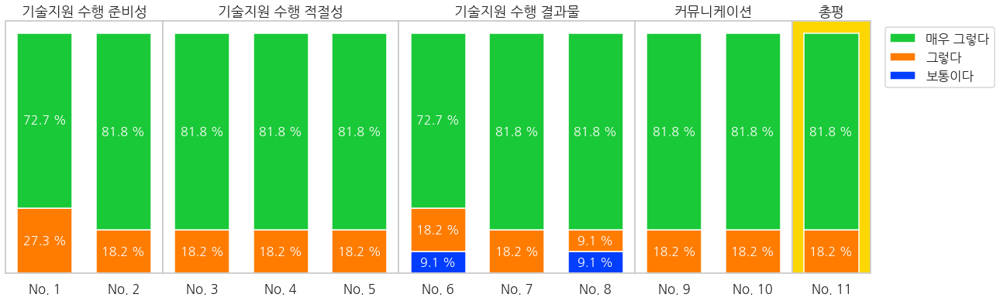

### **설문조사 결과 분석**

#### 1. Import Libraries


```python
import pegaplot as pp
from pegaplot import df2md

import pandas as pd
import numpy as np
import matplotlib.pyplot as plt
import seaborn as sns
```

    버전:  3.1.1
    설치 위치:  /opt/conda/lib/python3.7/site-packages/matplotlib/__init__.py
    설정 위치:  /root/.config/matplotlib
    캐시 위치:  /root/.cache/matplotlib
    설정 파일 위치:  /opt/conda/lib/python3.7/site-packages/matplotlib/mpl-data/matplotlibrc
    NanumGothic
    # matplotlib 한글 사용 가능
    # Seaborn Figure Style : whitegrid, bright, talk
    # Available Functions : df2md(), bar(), pie(), donut(), dist(), dists(), scatter()


#### 2. Read Data


```python
df = pd.read_csv('survey.csv', encoding='euc-kr')
df2md(df)
```


(index)|Username|name|department|No. 1|No. 2|No. 3|No. 4|No. 5|No. 6|No. 7|No. 8|No. 9|No. 10|No. 11
---|---|---|---|---|---|---|---|---|---|---|---|---|---|---
0|jcpark@kier.re.kr|박지찬|청정연료연구실|5|5|5|5|5|5|5|5|5|5|5
1|hyungoo@kier.re.kr|김현구|신재생에너지자원정책센터|5|5|5|5|5|5|5|5|5|5|5
2|jungchul.choi@kier.r ...|최정철|JGRC|4|4|4|4|4|4|4|4|4|4|4
3|kimkh@kire.re.kr|김기환|태양광연구실|4|5|4|4|4|3|5|3|4|4|4
4|hscho@kier.re.kr|조현석|수소연구실|5|5|5|5|5|5|5|5|5|5|5
5|ckkim@kier.re.kr|김창기|신재생에너지자원정책센터|4|4|5|5|5|5|4|5|5|5|5
6|sh1top@kier.re.kr|김선형|청정연료연구실|5|5|5|5|5|5|5|5|5|5|5
7|hanayoon@kier.re.kr|윤하나|분리변환소재연구실|5|5|5|5|5|5|5|5|5|5|5
8|hanayoon@kier.re.kr|윤하나|분리변환소재연구실|5|5|5|5|5|4|5|5|5|5|5
9|cozmoz67@kier.re.kr|최영우|수소연료전지산학연협력센터|5|5|5|5|5|5|5|5|5|5|5
10|foifrit@kier.re.kr|서민호|수소연료전지산학연협력센터|5|5|5|5|5|5|5|5|5|5|5


#### 3. Data Extraction: 항목별 데이터 수 세기


```python
xs = df.columns[3:14].tolist()
print(xs)
```

    ['No. 1', 'No. 2', 'No. 3', 'No. 4', 'No. 5', 'No. 6', 'No. 7', 'No. 8', 'No. 9', 'No. 10', 'No. 11']


```python
dfx = df[xs]
dfxc = dfx.apply(pd.value_counts).fillna(0).astype(int)
df2md(dfxc)
```


(index)|No. 1|No. 2|No. 3|No. 4|No. 5|No. 6|No. 7|No. 8|No. 9|No. 10|No. 11
---|---|---|---|---|---|---|---|---|---|---|---
3|0|0|0|0|0|1|0|1|0|0|0
4|3|2|2|2|2|2|2|1|2|2|2
5|8|9|9|9|9|8|9|9|9|9|9


#### 4. Plot: Stacked Bar Graph


```python
dfxp = dfxc/11
df2md(dfxp)
```


(index)|No. 1|No. 2|No. 3|No. 4|No. 5|No. 6|No. 7|No. 8|No. 9|No. 10|No. 11
---|---|---|---|---|---|---|---|---|---|---|---
3|0.0|0.0|0.0|0.0|0.0|0.09090909090909091|0.0|0.09090909090909091|0.0|0.0|0.0
4|0.2727272727272727|0.18181818181818182|0.18181818181818182|0.18181818181818182|0.18181818181818182|0.18181818181818182|0.18181818181818182|0.09090909090909091|0.18181818181818182|0.18181818181818182|0.18181818181818182
5|0.7272727272727273|0.8181818181818182|0.8181818181818182|0.8181818181818182|0.8181818181818182|0.7272727272727273|0.8181818181818182|0.8181818181818182|0.8181818181818182|0.8181818181818182|0.8181818181818182


```python
from matplotlib import gridspec
from functools import reduce

fig = plt.subplots(figsize=(20,6), sharey=True)

catno = [2,3,3,2,1]
gs = gridspec.GridSpec(nrows=1, ncols=5, width_ratios=catno, wspace=0)

ax0 = plt.subplot(gs[0])
ax1 = plt.subplot(gs[1])
ax2 = plt.subplot(gs[2])
ax3 = plt.subplot(gs[3])
ax4 = plt.subplot(gs[4])

titles = ['기술지원 수행 준비성', '기술지원 수행 적절성', '기술지원 수행 결과물', '커뮤니케이션', '총평']

for i in range(len(catno)):
    ax = eval('ax'+str(i))
    ax.grid(False)
    ax.set_yticklabels('')
    ax.set_title(titles[i])
    
    start = reduce(lambda x, y: x+y, catno[:i],0)
    end = reduce(lambda x, y: x+y, catno[:i+1],0)
#     print(start, end)
    ax.bar(dfxp.columns[start:end], dfxp.iloc[0,start:end], width=0.7, label='보통이다')
    ax.bar(dfxp.columns[start:end], dfxp.iloc[1,start:end], width=0.7, bottom=dfxp.iloc[0,start:end], label='그렇다')
    ax.bar(dfxp.columns[start:end], dfxp.iloc[2,start:end], width=0.7, bottom=dfxp.iloc[0,start:end] + dfxp.iloc[1,start:end], label='매우 그렇다')
    ax.set_xlim([-0.5, end-start-0.5])
    
    for xpos, ypos, yval in zip(dfxp.columns[start:end], dfxp.iloc[0,start:end]/2, dfxp.iloc[0,start:end]):
      if yval != 0:
        ax.text(xpos, ypos, "%.1f %%" % (yval * 100), ha="center", va="center", fontsize=16, color='white')
    for xpos, ypos, yval in zip(dfxp.columns[start:end], dfxp.iloc[0,start:end] + dfxp.iloc[1,start:end]/2, dfxp.iloc[1,start:end]):
      if yval != 0:
        ax.text(xpos, ypos, "%.1f %%" % (yval * 100), ha="center", va="center", fontsize=16, color='white')
    for xpos, ypos, yval in zip(dfxp.columns[start:end], dfxp.iloc[0,start:end] + dfxp.iloc[1,start:end] + dfxp.iloc[2,start:end]/2, dfxp.iloc[2,start:end]):
      if yval != 0:
        ax.text(xpos, ypos, "%.1f %%" % (yval * 100), ha="center", va="center", fontsize=16, color='white')

ax4.set_facecolor('gold')        
        
handles, labels = ax.get_legend_handles_labels()
plt.legend(handles[::-1], labels[::-1], bbox_to_anchor=(1.1, 1.))        
plt.savefig('./images/summary.png', bbox_inches='tight', pad_inches=0.02)

```




