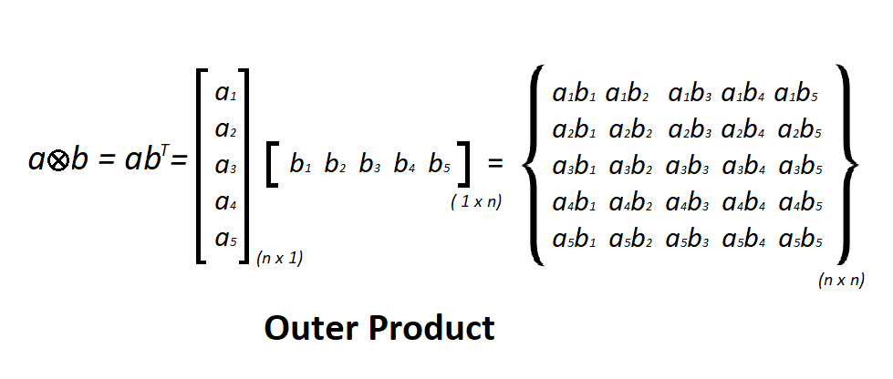
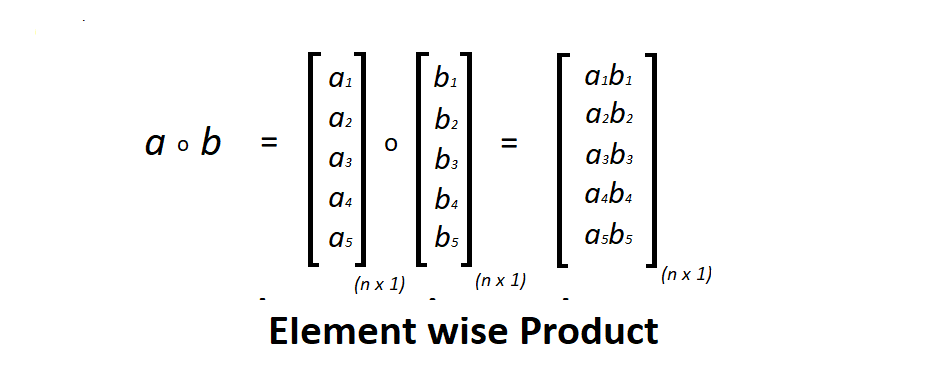

### Numpy Vectorization
> https://www.geeksforgeeks.org/vectorization-in-python/

> **outer(a, b) :** Outer product.  
> **multiply(a, b) :** Element wise product.  
> **dot(a, b) :** Inner product.  
> **zeros((n,m)) :** (n,m) matrix filled with zeros.  
> **process_time() :** (system + user CPU) time of the process.  


```python
import time
import numpy as np
import array
```

#### 1. Dot Product


* 8 byte size int


```python

a = array.array('q')
for i in range(100000):
  a.append(i);

b = array.array('q')
for i in range(100000, 200000):
  b.append(i)
```

##### 1.1. classic dot product of vectors implement


```python
tic = time.process_time()
dot = 0.0;

for i in range(len(a)):
  dot += a[i] * b[i]

toc = time.process_time()

print('dot_product = {}'.format(dot));
print('computation time = {} ms'.format(1000*(toc-tic)))
```

    dot_product = 833323333350000.0
    computation time = 31.25 ms
    

##### 1.2. numpy dot product


```python
n_tic = time.process_time()
n_dot_product = np.dot(a, b)
n_toc = time.process_time()

print('dot_product = {}'.format(n_dot_product))
print('computation time = {} ms'.format(1000*(n_toc - n_tic)))
```

    dot_product = 833323333350000
    computation time = 0.0 ms
    

#### 2. Outer Product




```python
a = array.array('i')
for i in range(200):
  a.append(i);
  
b = array.array('i')
for i in range(200, 400):
  b.append(i)
```

##### 2.1. classic outer product of vecters implementation


```python
tic = time.process_time()
outer_product = np.zeros((200, 200))

for i in range(len(a)):
  for j in range(len(b)):
    outer_product[i][j] = a[i]*b[j]

toc = time.process_time()

print('outer_product = {}'.format(outer_product))
print('computation time = {} ms'.format(1000 * (toc-tic)))
```

    outer_product = [[    0.     0.     0. ...     0.     0.     0.]
     [  200.   201.   202. ...   397.   398.   399.]
     [  400.   402.   404. ...   794.   796.   798.]
     ...
     [39400. 39597. 39794. ... 78209. 78406. 78603.]
     [39600. 39798. 39996. ... 78606. 78804. 79002.]
     [39800. 39999. 40198. ... 79003. 79202. 79401.]]
    computation time = 31.25 ms
    

##### 2.2. numpy outer product


```python
n_tic = time.process_time()
outer_product = np.outer(a, b)
n_toc = time.process_time()

print('outer_product = {}'.format(outer_product))
print('computation time = {} ms'.format(1000 * (n_toc-n_tic)))
```

    outer_product = [[    0     0     0 ...     0     0     0]
     [  200   201   202 ...   397   398   399]
     [  400   402   404 ...   794   796   798]
     ...
     [39400 39597 39794 ... 78209 78406 78603]
     [39600 39798 39996 ... 78606 78804 79002]
     [39800 39999 40198 ... 79003 79202 79401]]
    computation time = 0.0 ms
    

#### 3. Element wise Product




```python
a = array.array('i')
for i in range(50000):
  a.append(i);

b = array.array('i')
for i in range(50000, 100000):
  b.append(i)
```

##### 3.1. Classic element wise product of vectors implementation


```python
vector = np.zeros((50000))

tic = time.process_time()

for i in range(len(a)):
  vector[i] = a[i]*b[i]

toc = time.process_time()

print('element wise product = {}'.format(vector))
print('computation time = {} ms'.format(1000 * (toc-tic)))
```

    element wise product = [0.00000000e+00 5.00010000e+04 1.00004000e+05 ... 4.99955001e+09
     4.99970000e+09 4.99985000e+09]
    computation time = 15.625 ms
    

##### 3.2. numpy element wise product


```python
n_tic = time.process_time()

vector = np.multiply(a, b)

n_toc = time.process_time()

print('element wise product = {}'.format(vector))
print('computation time = {} ms'.format(1000 * (n_toc-n_tic)))
```

    element wise product = [        0     50001    100004 ... 704582713 704732708 704882705]
    computation time = 0.0 ms
    
